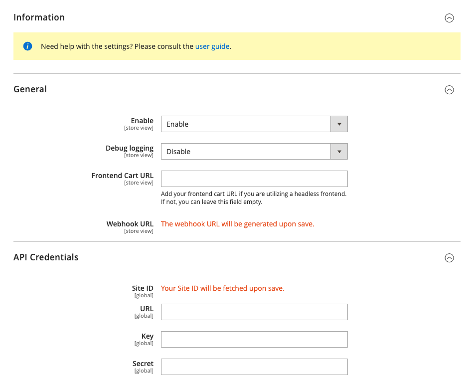

# Module Configuration

The module configuration can be found in the Magento 2 admin panel.

Go to `Stores > Configuration > Vicinity Media > Ad2Cart`.

## Section: General

| Field             | Description                                                                      | Note                                                                                                       |
|-------------------|----------------------------------------------------------------------------------|------------------------------------------------------------------------------------------------------------|
| Enable            | Enable / Disable the module.                                                     | Enabled by default                                                                                         |
| Debug logging     | Enable / Disable debug logging.                                                  | Useful for debugging issues. Keep disabled when not in use.                                                |
| Frontend Cart URL | The frontend cart URL.                                                           | Only required if your Magento instance uses a headless front end (ie. PWA, React, etc).                    |
| Webhook URL       | Communication link between your Magento instance and Vicinity Media Ad2Cart API. | The webhook URL is auto-generated on save. Its is an obfuscated URL that is used add products to the cart. |

## Section: API Credentials

| Field   | Description                        | Note                                                                               |
|---------|------------------------------------|------------------------------------------------------------------------------------|
| Site ID | Vicinity Media Ad2Cart Site ID.    | This will be displayed when your API credentials have been validated successfully. |
| URL     | Vicinity Media Ad2Cart API URL.    | Obtained from Vicinity Media.                                                      |
| Key     | Vicinity Media Ad2Cart API key.    | Obtained from Vicinity Media.                                                      |
| Secret  | Vicinity Media Ad2Cart API secret. | Obtained from Vicinity Media.                                                      |

When both sections are completed, click the `Save Config` button to save the configuration.
During the save process:
- the webhook URL is auto-generated and will be displayed in the configuration.
- the API credentials are validated against the Vicinity Media Ad2Cart API, along with a payload that contains the following information:
  - platform
  - platform_version
  - webhook_url
  - website_url
  - frontend_url

For transparency, the payload is used to determine how Vicinity Media Ad2Cart will forward the product data to your Magento instance.
